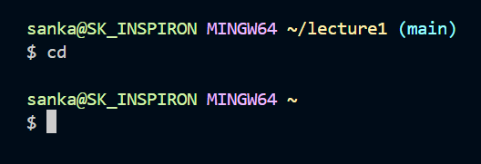
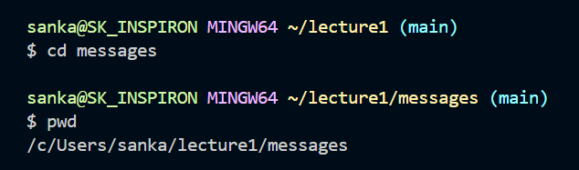
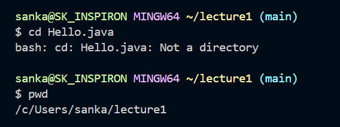
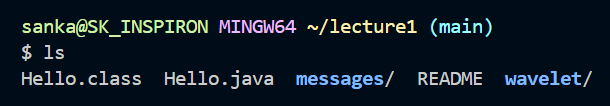
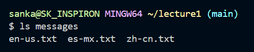
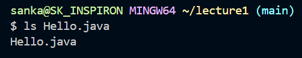
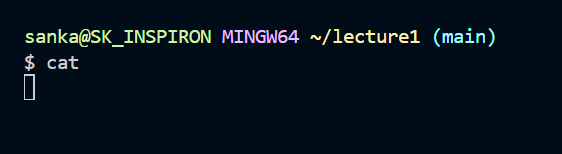
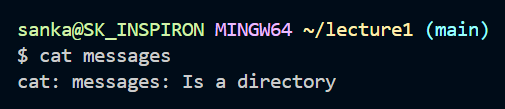
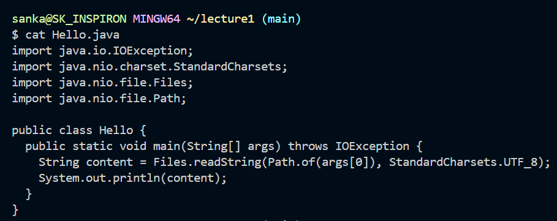

# Lab Report 1 - Remote Access and FileSystem (Week 1)
1. `cd`
- **no arguments**  
  
working directory: `/c/Users/sanka/lecture1`  
'cd' with no argument has no specific directory to go into, and takes us to the home directory, or `~` by default.  
There was no error.
- **path to directory**  
  
working directory: `/c/Users/sanka/lecture1`  
The `cd` command with specified directory `messages` takes us into the `messages` directory as shown in the image. The current directory now is `/c/Users/sanka/lecture1/messages`.  
There was no error.  
- **path to file**  
  
working directory: `/c/Users/sanka/lecture1`  
The `Hello.java` file doesm't contain any other files within itself (it's not a directory), so we cannot 'go' inside of it. This command therefore gives an error.  
There was an error. `cd Hello.java` gives an error because the argument is not a directory that we can enter.  
2. `ls`  
- **no arguments**  
  
working directory: `/c/Users/sanka/lecture1`  
`ls` command with no argument just diplays the contents of the working directory, so `lecture1`.  
There was no error.  
- **path to directory**  
  
working directory: `/c/Users/sanka/lecture1`  
`ls messages` with a directory as an argument outputs the contents of the specified directory, in this case, `messages`. As a side note, If I tried to ls a directory *outside* the current directory, it would throw an error.  
There was no error.  
- **path to file**  
  
working directory: `/c/Users/sanka/lecture1`  
`ls Hello.java` just outputs the name of the file "Hello.java" as it is not a directory that contains other files within itself.  
There was no error.  
3. `cat`  
- **no arguments**  
  
working directory: `/c/Users/sanka/lecture1`  
`cat ` with no argument just waits for the user to type in something, and then, (This is not shown in the image above) prints out the same input. The terminal just waits for user input, and doesn't give out an immediate output, as shown in the image.  
This does not give an error.  
- **path to directory**  
  
working directory: `/c/Users/sanka/lecture1`  
`cat messages` doesn't print out the contents within the directory because it is simply a container of different files/directories, and isn't a file that contains text. The output just reinforces that messages is a directory that cannot be 'printed'  
The output is an error that tells us that the argument cannot be a directory.  
- **path to file**  
  
working directory: `/c/Users/sanka/lecture1`  
`cat Hello.java` prints out the contents of the Hello.java file contained within the current working directory.  
There is no specific error.  

