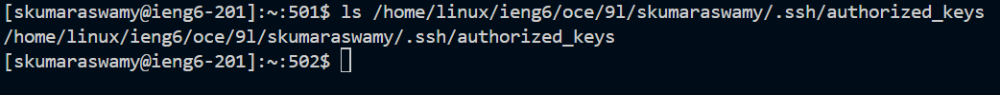

# CSE 15L - LAB REPORT #2 
## Part 1:
**CHAT SERVER JAVA CODE**  
  
  
**ADD-MESSAGE IMPLEMENTATION 1**
  
URL: http://localhost:4000/add-message?s=Hello&user=jpolitz 
Method Called: handleRequest 
Arguments: URI object representing the URL above. 
Changing Values: messages, message, user 
Relevant Field Values Before: messages = "", message=null, user=null 
Relevant Field Values After: messages = "jpolitz: Hello\n"  
**ADD-MESSAGE IMPLEMENTATION 2**
  
URL: http://localhost:4000/add-message?s=How%20are%20you&user=Sankalp 
Method Called: handleRequest 
Arguments: URI object for the URL above. 
Relevant Field Values Before: messages = "jpolitz: Hello\n", message=Hello, user=jpolitz 
Relevant Field Values After: messages = "John: Hello\nSankalp: How are you\n", message=How are you, user=Sankalp  
## Part 2:
1.     
2.     
3.      
## Part 3:

  

