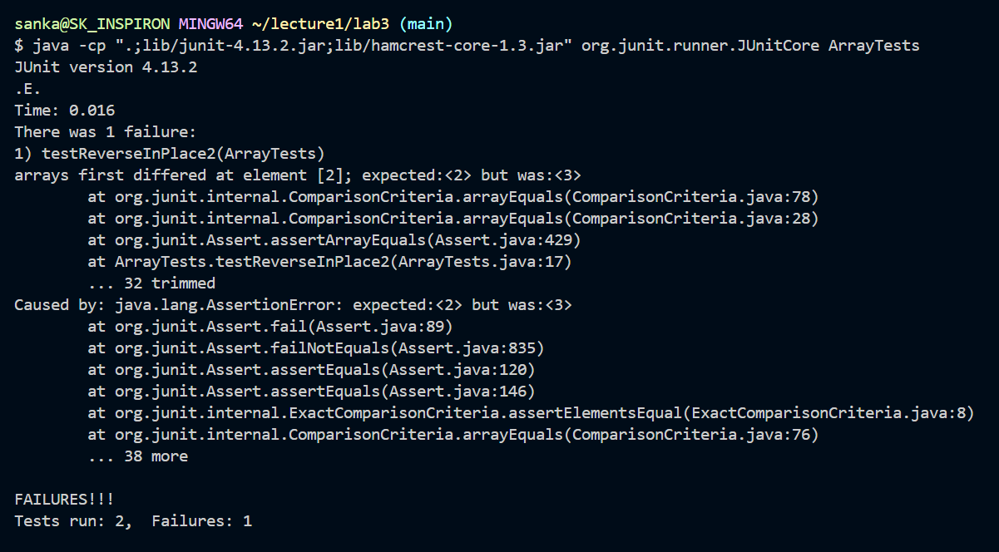

# Lab Report 3 - Bugs and Commands (Week 5)
## Part 1 - Bugs (ReverseInPlace in ArrayExamples.java)
1. Failure-Inducing Input 
`@Test` 
   `public void testReverseInPlace2() {` 
    `int[] input2 = {1, 2, 3, 4};` 
    `ArrayExamples.reverseInPlace(input2);` 
    `assertArrayEquals(new int[]{4, 3, 2, 1}, input2);` 
	`}`
2. Non-Failure-Inducing Input 
`@Test`  
 `public void testReverseInPlace() {` 
    `int[] input1 = { 3 };` 
    `ArrayExamples.reverseInPlace(input1);` 
    `assertArrayEquals(new int[]{ 3 }, input1);` 
	`}`
4. Symptoms 
  
5. Bug (Before & After) 
   Before: 
     `static void reverseInPlace(int[] arr) {` 
    `for(int i = 0; i < arr.length; i += 1) {` 
     `arr[i] = arr[arr.length - i - 1];` 
    `}}` 
   After: 
    `static void reverseInPlace(int[] arr) {` 
    `int temp;` 
    `for(int i = 0; i < arr.length/2; i += 1) {` 
      `temp = arr[i];` 
      `arr[i] = arr[arr.length - i - 1];` 
      `arr[arr.length - i - 1] = temp;` 
    `}}` 
7. The Fix Explained 
   The bugged code (BEFORE) tried to traverse through the array and directly replace values at indexes with the values on the corresponding indexes at the other end, hence trying to reverse the array. However, it failed to realize that when the first few index values are replaced with new values, we lose the values that were initially stored there, that can no longer be retrieved and used to replace the latter part of the array. The reverseInPlace code that I fixed (AFTER) introduced a `temp` variable that stored the index's initial values before replacing them with new values. This way, we don't lose the initial values, and can therefore replace the reverse index values with the stored values.  
## Part 2 - Researching Commands
### Command Chosen: grep
1. `grep -i` : case-insensitive search 
a.
   `grep -i "cardiovascular" 1468-6708-3-1.txt` 
        `trials to detect survival differences or cardiovascular` 
          `Study design: The Cardiovascular Health` 
          `The Cardiovascular Health Study (CHS) is a` 
          `cardiovascular disease (prevalent heart disease,` 
        `CHS Cardiovascular Health Study` 
	This is useful when I want to look for all the lines that contain the work "cardiovascular" regardless of whether characters are uppercase or lowercase. 
b.
`$ grep -i "hufl6800" gb-2003-4-9-r60.txt` 
`composed of HuFL6800 probe sets. Notably, MatchMiner does` 
Some specific jargon within the medical fields are oddly capitalized, such as HuFL6800, so using `grep -i` could make it easier to look for such substances for users without much scientific knowledge.

3. `grep -l` : restricts search to filenames 
   a. `$ grep -l "dna" *.txt` 
`1471-2091-2-13.txt` 
`1471-2105-3-6.txt` 
`1471-213X-1-9.txt` 
`1471-2180-1-12.txt` 
`1471-2180-3-10.txt` 
`1471-2180-3-13.txt` 
`gb-2001-2-12-research0054.txt` 
`gb-2002-3-3-research0012.txt` 
`gb-2002-4-1-r2.txt` 
This specific command helps the user look for the files where dna is a subject, and not each specific line. This can be useful as the user may want to read files about dna, and isnt looking for every instance of it. 

   b.
   `$ grep -l "2005" *.txt` 
`journal.pbio.0020028.txt` 
`journal.pbio.0020161.txt` 
`journal.pbio.0030056.txt` 
`pmed.0020016.txt` 
`pmed.0020023.txt` 
`pmed.0020039.txt` 
`pmed.0020061.txt` 
`pmed.0020067.txt` 
`pmed.0020158.txt` 
`pmed.0020160.txt` 
`pmed.0020208.txt` 
`pmed.0020209.txt` 
`pmed.0020210.txt` 
`pmed.0020216.txt` 
`pmed.0020278.txt` 
`pmed.0020281.txt` 
This command is useful in this scenario because the user can look for files that correspond to a specific timeframe, such as articles from the year "2005", in this specific scenario.
5. `grep -n` : shows the exact line numbers of search 
   a.
   `$ grep -n "Gonzalez" chapter-1.txt` 
`78:    At 8:21, one of the American employees receiving Ong's call in North Carolina...` 
`86:    At 8:38, Ong told Gonzalez that the plane was flying erratically again` 
`92:    At 8:44, Gonzalez reported losing phone contact with Ong.` 
The command outputs the specific line numbers of the lines that contain Gonzalez.I have cut short the descriptions due to space restrictions, but this command could be very useful in situations where the chronological order of things matter, like in this case where we can see the exact lines in the 911report where Gonzalez is in communication with others, and the number of events that have passed in between. 
   b.
   `$ grep -n "RNA" rr74.txt` 
`40:        hypoxia from birth and measured NOS mRNA and protein` 
`73:          protein and RNA measurement, and the left lung was fixed` 
`114:          Total RNA was extracted from 100 mg of frozen lung `     
`118:          2 O. RNA was quantified and samples` 
`125:          Biosystems, Foster City, CA, USA). RNA quantity was` 
This `grep -n` looks for lines that contains "RNA" in the rr74.txt file and outputs their corresponding line numbers as well. This could be useful, if perhaps the user decided to replace all the DNAs with RNA. Then he would know which lines to find "RNA" in, making it simpler. 
   
7. `grep -r` : recursively searches through directories 
   a.
   `$ grep -r "President"` 
`About_LSC/Comments_on_semiannual.txt:President of the United States with the advice and consent of the` 
`Env_Prot_Agen/final.txt:III. Health and Environmental Benefits of the President's` 
`Media/Barnes_new_job.txt:our national creed. I, for one, will not forget President Bush's` 
`Post_Rate_Comm/Gleiman_EMASpeech.txt:Kappel Commission---appointed by the President to study the future` 
This command was run with `technical/Government` as my working directory. Again, I have cut down the output significantly, however, this shows how I use the `grep -r` command for a directory such as `government` with numerous subdirectories to look for specific words recursively. This command also outputs the specific subdirectory that the line exists in, making it very organized. 
   b.
   `$ grep -r "Charles Katholi"` 
   `$ grep -r "Charles Katholi"` 
   `biomed/1475-2883-2-11.txt:          Charles Katholi (The University of Alabama, Birmingham) [` 
   This command can also be used to find a certain keywords withing numerous directories and numerous files. `grep -r "Charles Katholi"` was run with `technical` as my working directly, and looked for the particular name within the numerous subdirectory files within it.  
### Citation: https://man7.org/linux/man-pages/man1/grep.1.html
I looked up the commands from the link above, and played along with them on my VSCode command line to figure out what their functions are.
   
   
