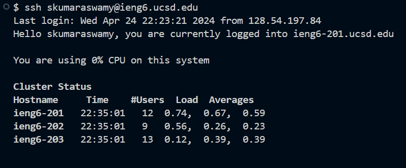

# LAB REPORT 4
## Step 4 
### Log into ieng6
1.     
2. `<s><s><h><space><ctrl-shift-v><enter>` 
3. I copied my ieng6 user name and used `ssh` to log into my ieng6 server. I don't need to type in a password because I had set up the ssh keys in Lab 3.
## Step 5
### Clone Lab 7 Repository
1.    
2. `<g><i><t><space><c><l><o><n><e><space><ctrl-shift-v><enter>`  
3. I copied the ssh clone link from github after setting up my public key. Then I used `git clone` along with the ssh-clone url for my forked lab7 repository, which cloned all the files into my local repository.
## Step 6
### Run the Failing Tests
1.    
2. `<c><d><space><l><a><tab><enter>`   `<b><a><s><h><space><t><e><s><tab><enter>`  
3. I used the `cd` command along with `<l><a>` and `<tab>` to autofil the rest of the directory. This command changed my directory to the `lab7` directory. Then I ran `bash test.sh`, using `<tab>` to autofil again, in order to run my test.sh tests. As the image shows, 2 tests were run, and 1 failed.
## Step 7
### Edit the Code using Vim
1.       
2. `<v><i><m><space><L><i><s><tab><.><j><tab><enter>`   `<:><4><4><enter>`   `(hold)<shift><right>(release hold)<left>`   `<i><backspace><2><ctrl-c>`    `<:><w><q>`  
3. I used the `vim` command to open the `ListExamples.java` file. Then I moved the cursor to line 44(where the bug is) using `:44`. I then held shift and moved right to skip the entire first word, which was `index1`, then moved left. Then I switch the vim mode to insert mode by pressing `<i>`and pressed `backspace` to delete the 1. Then, I typed `2` and pressed `<ctrl-c>` to exit insert mode. Then I typed `:wq` in command mode to save and exit the vim file, saving the changes made.
## Step 8
### Run the Passing Tests
1.    
2. `<up><up>` OR `<b><a><s><h><space><t><e><tab><enter>` 
3. I re-ran the test file using bash (using the up key twice, because the command was in my history) and this time both tests passed as shown in the image above.
## Step 9
### Commit and Push Changes
1.          
2. `<g><i><t><space><s><t><a><t><u><s><tab><enter>`   `<g><i><t><space><c><o><m><m><tab><-><a><space><-><m><space><"><f><i><x><e><d><space><t><h><e><space><b><u><g><"><enter>`   `<g><i><t><space>
<u><s><tab><o><r><tab><m><a><tab><enter>`  
3. I used `git status` to review the state of my changes. It shows the files that I modified. Then I used  `git commit -a -m "fixed the bug"` to save/commit the changes with the given message to my local repository. Then I used `git push ` to push my changes to the `origin` remote and  `main` branch. The changes were commited and pushed as seen in the images above.
