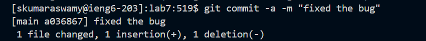

# LAB REPORT 4
## Step 4 
### Log into ieng6
1.   
3. e
4. 4
## Step 5
### Clone Lab 7 Repository
1.   
2. 3
3. 4
## Step 6
### Run the Failing Tests
1.   
2. 2
3. 2
## Step 7
### Edit the Code using Vim
1.      
2. 3
3. 3
## Step 8
### Run the Passing Tests
1.   
2. 2
3. 2
## Step 9
### Commit and Push Changes
1.         
2. d
3. d
