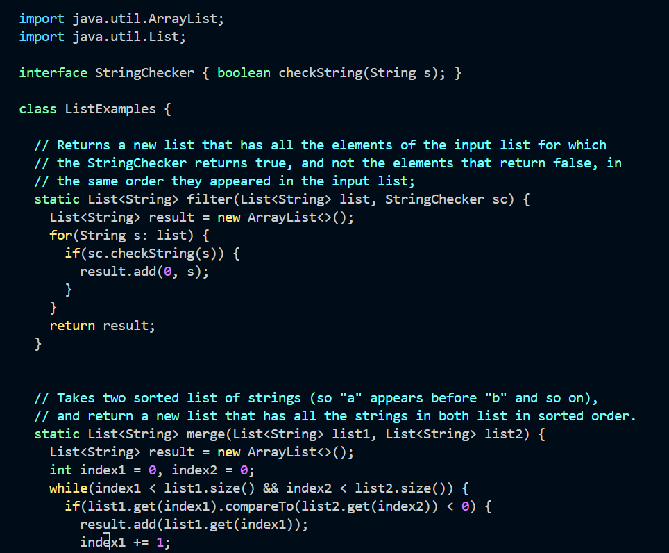

# LAB REPORT 4
## Step 4 
### Log into ieng6
1.   
2. e
3. 4
## Step 5
### Clone Lab 7 Repository
1.    
2. `<g><i><t><space><c><l><o><n><e><space><ctrl-shift-v><enter>`  
3. I copied the ssh clone link from github after setting up my public key. Then I used `git clone` along with the ssh-clone url for my forked lab7 repository, which cloned all the files into my local repository.
## Step 6
### Run the Failing Tests
1.    
2. `<c><d><space><l><a><tab><enter>`   `<b><a><s><h><space><t><e><s><tab><enter>`  
3. I used the `cd` command along with `<l><a>` and `<tab>` to autofil the rest of the directory. This command changed my directory to the `lab7` directory. Then I ran `bash test.sh`, using `<tab>` to autofil again, in order to run my test.sh tests. As the image shows, 2 tests were run, and 1 failed.
## Step 7
### Edit the Code using Vim
1.       
2. 3
3. 3
## Step 8
### Run the Passing Tests
1.    
2. 2
3. 2
## Step 9
### Commit and Push Changes
1.          
2. d
3. d
